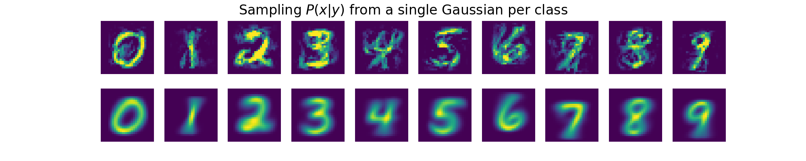
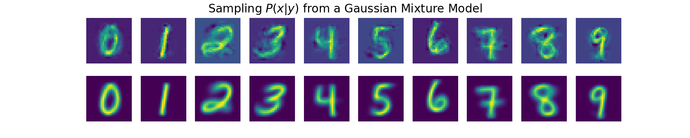

# Sampling using Bayesian Classifier

## Abstract

This is a demonstration of generative models, using Bayesian classifiers and unsupervised learning.


## Setup

Go to the Kaggle website. Create an account, if you have not done that yet,
and download the MNIST handwritten digits set: `train.csv` and `test.csv`.
Place the 2 files in the `data/` folder.

When using poetry as venv manager, just type `poetry install`. If you prefer
plain old pip, look in the `pyproject.toml` file for the necessary
libraries and install them in your python environment.

To run the examples:

```sh
# When using poetry venv
poetry shell

# Set the python path
export PYTHONPATH=`pwd`/src

# Go to the tests folder and run the examples.
cd tests
python test_....py
```


## Sampling

Now we sample from the model _P(x|y)_. When using the Bayesian Classifier with single
Gaussian modeling, it draws samples from a single Gaussian per class. The drawn 
samples don't look sharp. The path is:
```
Y -> X
```

*Figure 1: Top row shows drawn samples, bottom row shows mean of the class.*


When using the Bayesian Classifier with Gaussian Mixture Models, it draws samples
from one of the models in the given class. So, the path is from the class, via
the latent space, to a sample. The path is:
```
Y -> Z -> X
```

*Figure 2: Top row shows drawn samples, bottom row shows mean of the class for the selected cluster.*
